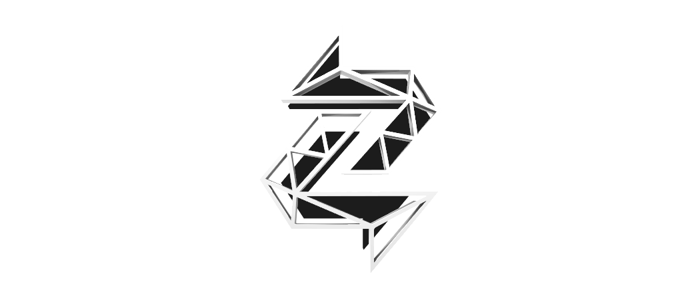

# *Welcome to Zentachain*

*Zentachain is a blockchain-based Platform that enables you to store your files and chat with users around the world, both with a level* *of *security and privacy that has never been available to the public before. Software creators can use Zentachain to host decentralized Apps* *and make them available to the world, more reliable and quicker than ever. By utilizing ground-breaking technologies like the Blockchain,* *smart-contracts and dpos, new highly secure forms of communication and data-transaction are made possible. Zentachain is combining these* *and other technologies to bring you a platform that’s ready for a future beyond the age of information.*

------------

##### The problem worth solving

*Need for secure interaction and digital data storage - owned by the initiators.*
*A. Resolve the thread of unauthorized data access and manipulation of information streams.*
*B. Protect against hackers - getting unauthorized access and stealing information, logging,harvesting and selling your data.*
*C. Leverage net neutrality*
*D. Ensure ownership of data and data security*
*E. Provide a secure framework for the hosting and creation of dApps*
*F. Ownership and security of cloud storage*
*G. Unencrypted, unsafe data storage Every transaction made on your device of issued by your*
*action on some digital medium is potentially logged and stored somewhere in a database or on a*
*file server. It is very likely this at this data isn’t properly encrypted or anonymized.*

------------

##### Vision

*Zentachain envisions a decentral ecosystem build for net neutral data- and transactions*
*interchange and data storage. The ecosystem is maintained by its users and immune against*
*several forms of cyber attacks and hacking. Next to that, viable solutions for security and data*
*ownership problems are present. The Zentachain is open source. Zentachain aims to become the*
*missing gap between decentralized meshnet cloud services such as IPFS (https://ipfs.io) and*
*dynamic routing and addressing protocols such as DNS and HTTPS. This comes down to the*
*fact that Zenta Labs will upgrade the IPFS peer-to-peer hypermedia protocol with state-of-the*
*art blockchain technology.*

*The web will not only become ultra secure and decentralized and made permanent, it will also*
*become faster and more open. Zentachain will enable the ability to address large amounts of data*
*with IPFS, and place the immutable, permanent IPFS links onto the Zenta ledger by using a*
*blockchain transaction. This timestamps and secures content, without having to put the data on*
*the Zentachain itself. Next to that, Zentachain will add additional encryption to files stored on the*
*meshnet. Zentachain brings the freedom and independent spirit of the web at full force and at low*
*cost. The ecosystem will help deliver content in a way which can save you considerable money.*
*High latency networks are a real barrier of entry to developing world, the Zentachain provides*
*resilient access to data, independent of low latency or connectivity to the backbone. Zentachain*
*wants to be truly decentral, without any exception and will design the ecosystem in such a*
*way that it never keep track on its users and will never save IP-address or any personal*
*information. By design the ecosystem simply doesn’t have this information nor can link*
*transactions to a certain user or identity.*

------------

##### What makes Zentachain awesome?

*Designed for decentralized privacy services. All the running dApps will be anonymous and secure by design, no record of users and* *linked transactions will be stored within the platform. To prove and demonstrate the capabilities of Zentachain, the team introduces a* *decentralized ultra-secure messenger*

------------

##### Zentalk

*Zentalk is a secured, decentralized peer-to-peer messenger App. Next to great usability,*
*under the hood you’ll find state-of-the-art encryption, security and since it’s decental,*
*Zentachain guaranties full anonymity. All communication sent and received through Zentalk*
*will be tunneled, pushed and dragged through a Zentamesh, a high performing Own Mesh-Network.This*
*gives Zentalk the unique advantage that it’s virtually immune against any forms of hack- or*
*modification events like censorship and eavesdropping attempts.*

------------

##### Zentalk & Zentamesh-network

*A Mesh Network is also known as MeshNet and is an alternative to the internet without any centralized authority.*
*Every participant in the MeshNet represents an independent Node that functions as a fully active access point to the network making it* *the most reliable form of a network available.*
*Whenever a node leaves the network the remaining nodes can easily redistribute the dataflow to the best available connection.*

*The MeshNet functions wirelessly and allows computers and devices to interact without a cable modem. The devices themselves create a* *largely distributed network which can potentially cover the whole globe.*
*Users in the MeshNet can anonymously send and receive encrypted data securely by swapping encryption keys with Blake2 Algorithm*
*making the data inaccessible to any third party.*

*In the future this network of distributed node-miniservers could stay available even if the regular internet collapsed.*
*Unlike the regular internet the MeshNet is also immune to censorship. Not only because it is a completely decentralized network, also* *due to its uniquely intelligent distribution and healing properties. A node that is taken offline will automatically be compensated by* *redistributing the traffic in the best way possible to the existing nodes around it.*
*That way information will continue to travel through the network at the best rate possible without interruption.*
*There is a point which one is the problem today it is the range and the gateways*

*In the last couple of years mesh networking functions have been integrated more and more into everyday applications. Especially in* *consumer electronics routers, WLAN repeaters and powerline adapters started implementing the technology.*
*For instance, the well-known German internet solution FritzBox is using MeshNet components with information that has a very low range.*

*The vision of Zentalk is to utilize this very technology to bring worldwide secure 24/7 live communication and data exchange to the* *masses. Without a central authority communication can run in between the active network Zentanodes, increasing the networks coverage with* *every joining user. As long as there are at least two active users in the Zentamesh-Network, communication can occur without the need for an* *internet or telephone service provider.*

*The Zentameshnet has self healing properties that contribute to the ability to achieve censorship*
*resistance. Self-healing means if a Zentanode connection is blocked or disabled, the Zentamesh-network can*
*patch and rerouted around the losted Zentanodes. The data is redirected and the network is still functional.*
*Zentamesh-network can be applied to both wired and wireless networks, as well as the Zentalk will*
*establish the Zentameshed WLAN (Wireless Local Access Network). This MWLAN is achieved through*
*the use of a Zentanodes Meshed WiFi. This will be required for offline communication owver Zentalk.*

##### Zentalk & Hyperboria
*Zentachain looks to address issues of privacy and online security through a decentralized*
*alternative to the Internet called Hyperboria. Hyperboria is a Mesh Network which utilizes the*
*cjdns protocol to ensure complete end-to-end encryption. This is achieved by using public-key*
*cryptography for address allocation and a distributed hash table for routing. Communication*
*between two nodes can only be established after the connection has been verified, eliminating*
*the possibility of third party intrusion or eavesdropping. Routing is executed using a system*
*similar to Kademlia DHT enabling the network to maintain an optimal load across all nodes.*
*Zentachain believes in the Open Internet. By employing Hyperboria we give our users the*
*opportunity to transmit their data in a fast, secure and private way, without having to fear*
*unwanted intrusion from malicious entities or centralized service providers.*

##### Blake2

-------------

##### Zentalk-Gateway

---------

##### Zentanode

---------

---------

##### Zentamesh

---------

##### Zentanode License

---------

##### Zenta-M-Wan

------------

##### Zentalk-Web

*You can use our Zental-Web version Beta for free*

* [Zentalk-Web](https://www.zentalk.chat)

-------------

##### The ZentaDex Exchanger

*Zentadex is a decentralized exchange (DEX) is a cryptocurrency exchange which operates in a decentralized way, i.e., without a central* *authority or it is an exchange market that does not rely on a third-party service to hold the customer's funds. Decentralized* *exchanges* *allow peer-to-peer trading of cryptocurrencies.*

*The most obvious benefit to using a decentralized exchange over a centralized one is their "trustless" nature. You are not required to* *trust the security or honesty of the exchange since the funds are held by you in your personal wallet and not by a third party.*

*Another advantage to the decentralized model is the privacy it provides. Users are not required to disclose their personal details to* *anyone, except if the exchange method involves bank transfers, in which case your identity is revealed only to the person that is* *selling or buying from you.*

*For more follow the below link:*

* [Zentadex](https://github.com/ZentaChain/Zentadex)

* [Zentadexdoc](https://github.com/ZentaChain/Zentadex/blob/master/ZENTADEX%20BLOCKCHAIN%20BASED%20DECENTRALIZED%20EXCHANGE.pdf)

------------

##### Zentavault

*Zentavault is a high-throughput encrypted and distributed file vault (encrypted storage) and*
*transfer service. Unlike regular data storage systemsk, Zentavault will store nothing on the*
*users device. Zentavault acts as an encryption delivery vehicle, with the ability to encrypt and*
*dynamically distribute content securely onto the InterPlanetary File System (IPFS). IPFS is a*
*peer-to-peer distributed file system that seeks to connect all computing devices with the same*
*system of files. In some ways, IPFS is similar to the World Wide Web, but IPFS could be seen*
*as a single BitTorrent swarm, exchanging objects within one Git repository.*

*For more follow the below link*

* [Zentavault](https://github.com/ZentaChain/Zentavault)

------------

##### Zentagate a gateway to IPFS (Zentavault)

*„IPFS-DNS and HTTP-Gateway will be 2 tasks for ZentaGate“*
*At Zentachain we take security and anonymity very serious. We designed Zentachain in such*
*a way that it is running on it’s own private Mesh network. Zentagate connects the ecosystem*
*to unsafe networks such as the Internet. Zentagate provides an additional encryption and antihack layer, to ensure userdata and* *transactions are guaranteed - safe. Next to gatekeeping*
*and safe-unsafe network relaying we plan on implementing a decentralized name service as*
*well. Zentagate will run this service - enabling routing and rerouting data and transactions in*
*and out the Zentachain*

------------

##### The Zenta Mobile Wallet

*For more follow the below link:*

* [Zentawallet](https://github.com/ZentaChain/Zentawallet)

------------

##### ZentaSwap is a IPFS Swaper

*ZentaSwap is a process by which one cryptocurrency is exchanged for another. Unlike selling one coin to buy another, a token swap is* *the change of one coin for another or token.*

 * [ZentaSwap](https://github.com/ZentaChain/ZentaSwap)
 
 ------------

##### The Zenta DPOS-Algorithm

*For more follow the below link:*

* [Zentadpos](https://github.com/ZentaChain/Documents/blob/master/ZentaDpos.pdf)

------------

##### Zentachain Whitepaper

*Go to our Whitepaper - English:*

* [Zentachain-Whitepaper](https://github.com/ZentaChain/Documents/blob/master/Zentachain-Whitepaper.pdf)

*Whitepaper - Turkish:*

*  [Zentachain-Whitepaper-Turkish](https://github.com/ZentaChain/Documents/blob/master/Zentachain-Whitepaper%20Turkish.pdf)

*Whitepaper - German:*

*  [Zentachain-Whitepaper-German-Soon]()

------------

[This project is under active development, there may be breaking changes.]
[Copyright all rights reserved Zentachain.io]
